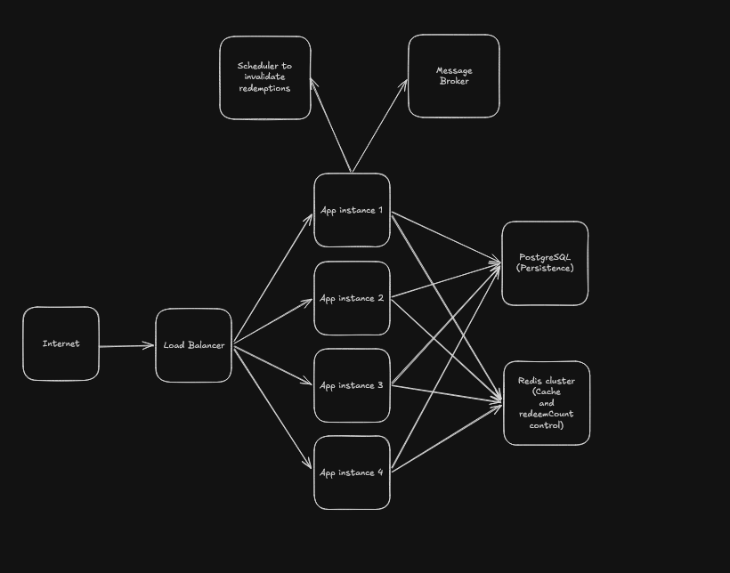
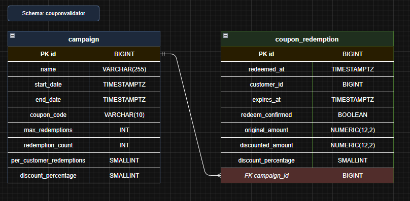

# Architecture

## High level topology



* Load balancer
* 4 App instances
* Redis cluster (Cache)
* PostgreSQL (Persistence)
* Message Broker (Communication with other services eg. payment-service)

## Project architecture

This project follows a layered architecture with a bit more independence on the api side.

* `application`: Layer responsible for the api (controllers, mappers, controller advice)
* `domain`: Layer responsible for the domain logic (services, entities, exceptions)
* `infrastructure`: Layer responsible for infrastructure (configuration and database)

## Data Model


* The only index needed was coupon_code, which is the main field which the system uses to query campaigns.
* coupon_code is also unique, so we can't have two campaigns with the same coupon code

# Handling concurrency
## How
* At this state Redis is pretty much responsible for handling concurrency.
* The project uses atomic counters to increase the coupon usage in a thread safe manner and with low latency.
* All the database operations are done asynchronously.
* The database connections are only used when needed.
* The first request to the redeem endpoint will warm up the cache, this is a blocking pessimist write lock so we can
  warm up the cache with the correct information
* All information to do the validations are stored on the cache
## Trade-offs
* This service is highly dependable on Redis and at this point there is no workaround if redis fail (Single point of failure)
* Dual write, at this state redis and postgres are completely independent and there is no retry/fallback for failure on any of them
* Pessimistic write lock on every cache miss, we can guarantee to have the most updated information on the cache, but we might have high latency if the Redis cluster is struggling
## What if the system fails?
* At this point the application would crash, this service needs a retry mechanism for the async db operations, and a fallback flow in case Redis is not available

# Assumptions
* At the moment of redeem, the user is already registered
* Payment/discount/redemption confirmation will be performed by another service and this service will receive a command to confirm the redemption
* PerCustomerRedemptions will be always smaller then max_redemptions
* Redemptions expires 15 minutes after the creation if a purchase is not confirmed via command/queue/topic

# How to run the project
* Dependencies: Docker, Gradle, Java 17
* First run `docker compose up -d` to create the necessary containers from the docker-compose file (Postgres, Redis)
* `./gradlew bootRun` to start the application

# Api contracts

## `POST /v1/coupons/redeem`

This endpoint is used to redeem a coupon

### Payload

```json
{
  "tier": Tier,
  "amount": BigDecimal,
  "couponCode": String,
  "customerId": Long
}
```

### Constraints

* `tier` is one of two values (PAID, TRIAL)
* `couponCode` Should be a string with 10 max chars

### Response

```json
{
  "originalAmount": BigDecimal,
  "discountedAmount": BigDecimal,
  "discountPercentage": short
}
```
* `discountedAmount` is the total discount amount, not the total amount - discount

### Error responses

`400 Bad Request`

#### Payload

```json
{
  "message": String
}
```

---

## `POST /v1/campaigns`

This endpoint creates a new campaign

### Payload

```json
{
  "name": String,
  "startDate": ISO-8601 DateTime,
  "endDate": ISO-8601 DateTime,
  "couponCode": String,
  "maxRedemptions": Int,
  "perCustomerRedemptions": Int,
  "dicountPercentage": Int
}
```

### Constraints

* `name` Should be a string with 255 max chars
* `couponCode` Should be a string with 10 max chars

### Response

```json
{
  "id": Long,
  "name": String,
  "startDate": ISO-8601 DateTime,
  "endDate": ISO-8601 DateTime,
  "couponCode": String,
  "maxRedemptions": Int,
  "perCustomerRedemptions": Int,
  "dicountPercentage": Int
}
```

---

## `GET /v1/campaigns/stats/{campaignId}`

This endpoint provides metrics about specific campaigns

### Response

```json
{
  "totalCouponRedeemed": Int,
  "uniqueUsers": Int,
  "totalDiscountAmount": BigDecimal
}
```

# Things that I would do with more time

* Implement an idempotency mechanism to avoid double-redemption
* Only counts the confirmed redemptions on users quota (Redemption succeed, but signup fails)
* Implement a fallback flow direct to the DB in case redis has any issues
* Implement retry mechanisms to avoid loosing redemptions if the db is slow
* Implement a better cache warm up to avoid allowing users to redem more than the allowed coupons
* Add a response code to give better feedback
* Calculate timezones to be able to manage worldwide campaigns
* Implement a multi coupon campaign
